# NanoNow

NanoNow is a science communication website that will serve as a learning resource about all things related to nanoscience. The site will be targeted towards people who are looking to learn about nanomaterials and nanotechnology. Nanonow will be useful to people without a deep scientific background who want accessible information on this topic, along with allowing a means for researchers in the field to communicate their work. 

## Features 

### Existing Features

- __Navigation Bar__

    - Featured on each page as a fully responsive element.
    - Fixed in place at the top of the screen while scrolling so that the user can seemlessly navigate the website regardless of where they are on the page.
    - Depending on which page the user is on, the currently active page will be highlighted in the navigation bar.
    - The site logo also serves as a navigation link to get back to the home page.
    - This will be valuable to the user as a means of navigating the site without using the back button and as an indication of where they are in the site.

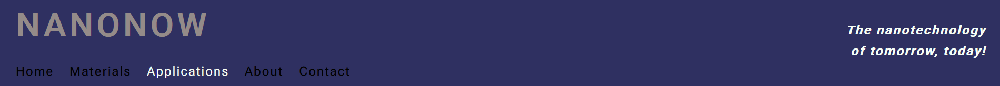

- __Hamburger navigation bar__

    - Under certain screen sizes, the navigation bar on each page disappears and is replaced by a hamburger button
    - This button, coded purely in HTML/CSS, serves as a dropdown menu with all the same navigation links as the naviagtion bar.
    - Hamburger button coded to postion itself under the site logo under certain screen sizes, so that the site logo has space to be read.
    - This will be valuable to users on mobile devices to gain the same functionality as the navigation bar.

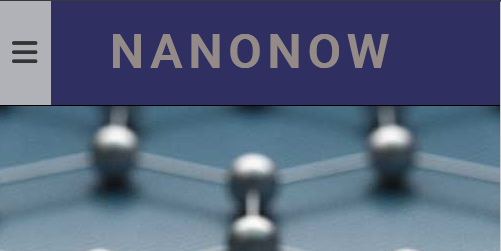
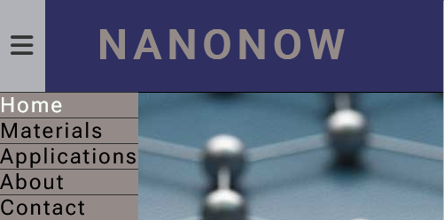
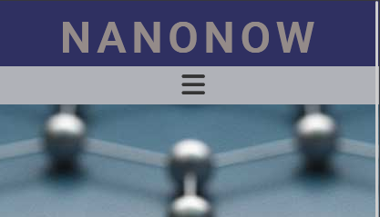

- __The landing page image__

  - The landing page includes an artistically rendered image of a nanomaterial and emphasized text which will stand out and interest the user in learning more about the topic.
  - The section also includes an eye-catching animation to bring attention to this image and draw the user into the site.

- __About Section__

  - The about section introduces the user to the reasons why learning about nanotechnology is useful, along with a simple demonstration to appreciate the size of the nanoscale.
  - Text is displayed in colored and stylistic text boxes.
  - Images are displayed in figures beside the textboxes to showcase the different applications of nanotechnology and assist in the explanation.
  - This will be valuable to the user as a visually appealing, non-intimidating layman's explanation of the topic to get the user interested in learning more and reading further into the site.

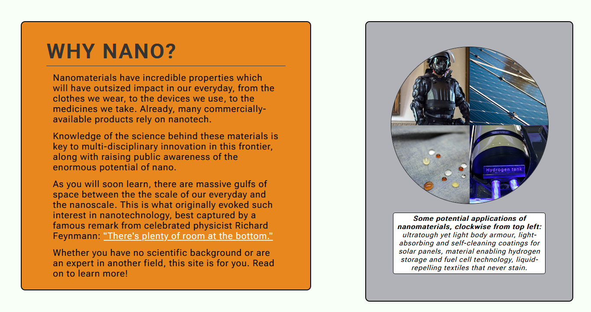
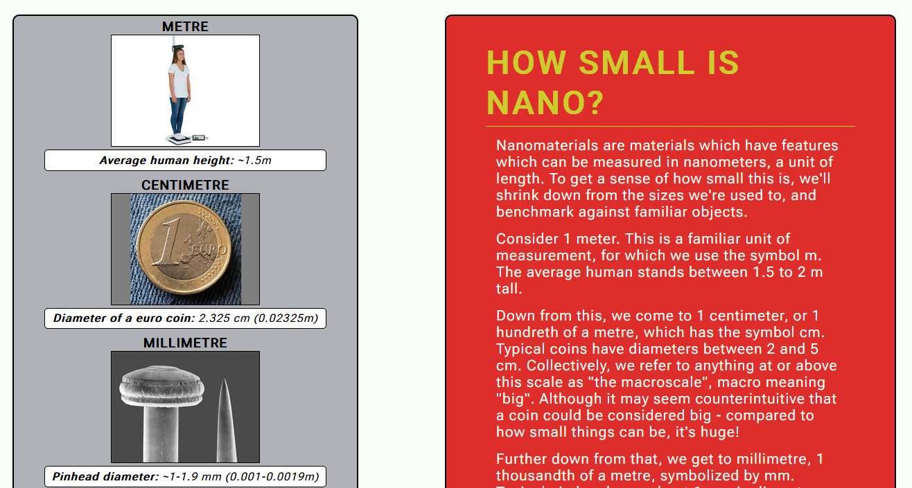
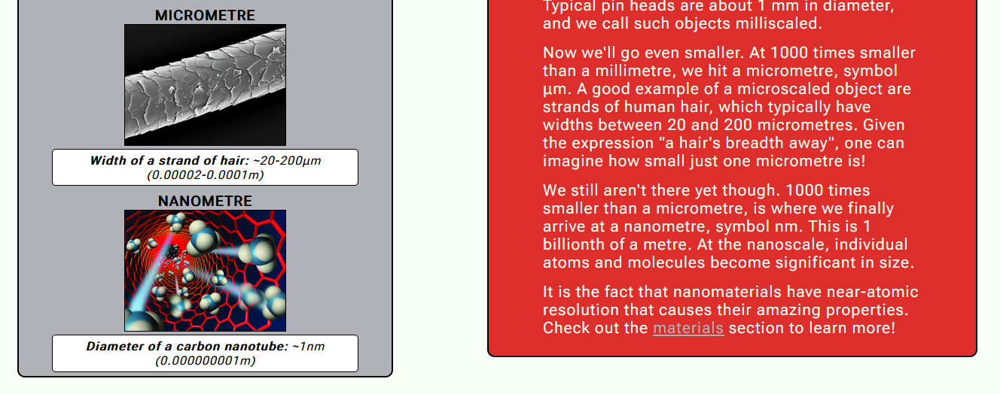

- __The Footer__ 

  - The footer includes icons which serve as social media links to nanonow's various social media pages.
  - Simple font-awesome icons are used to keep this minimalistic.
  - This will be valuable to the user as a means for them to become connected with nanonow's social pages for nanotechnology news.

- __Materials Page Image__

  - This serves as a headline image for the materials page. It contains a textbox that reads "MATERIALS".
  - It has an eye-catching background image of buckminister fullerenes that is animated to grab the users attention.
  - This will add value to the user as they will know they are on the materials page, and the visuals will intrigue them to learn more.

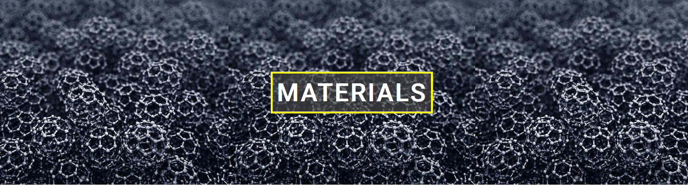

- __Materials Main Section__

  - This page educates the user on the different types of nanomaterials that exist, how they are classified, and their properties. 
  - Text is displayed in colored and stylistic text boxes.
  - Images of different nanomaterials are displayed in figures beside the text boxes to supplement them.
  - This will add value to the user as they will be able to deepen their knowledge on the topic with at an accessible level through a visually appealing webpage.

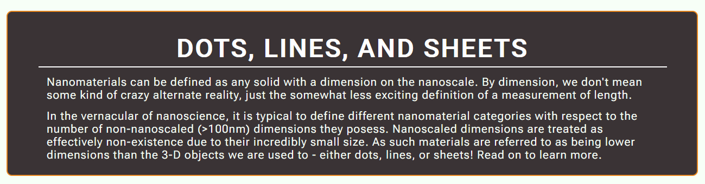

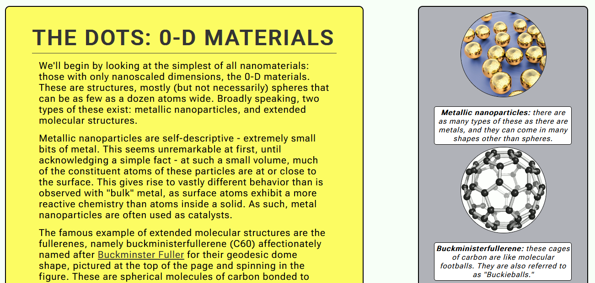
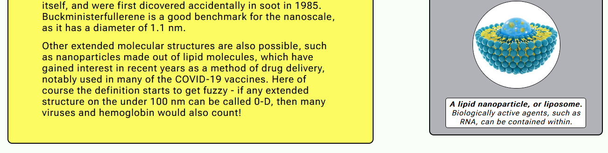
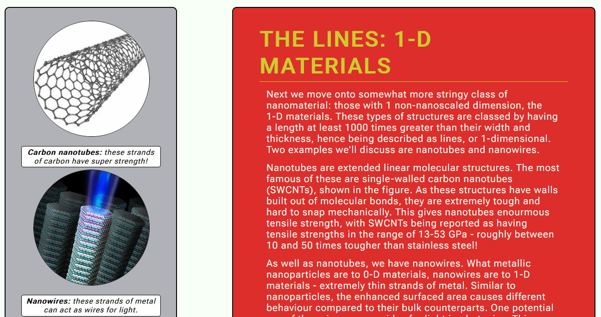
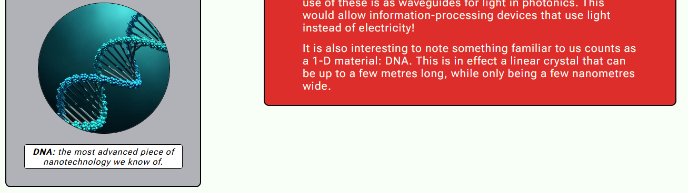
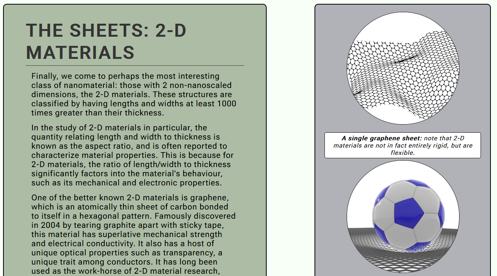
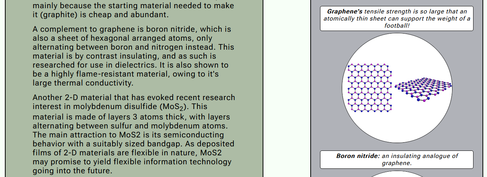
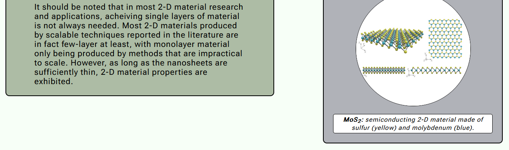

- __Applications Page Image__

  - This serves as a headline image for the applications page. It contains a textbox that reads "APPLICATIONS".
  - It has an eye-catching background image of a carbon-nanotube that is animated to grab the users attention.
  - This will add value to the user as they will know they are on the applications page, and the visuals will intrigue them to learn more.

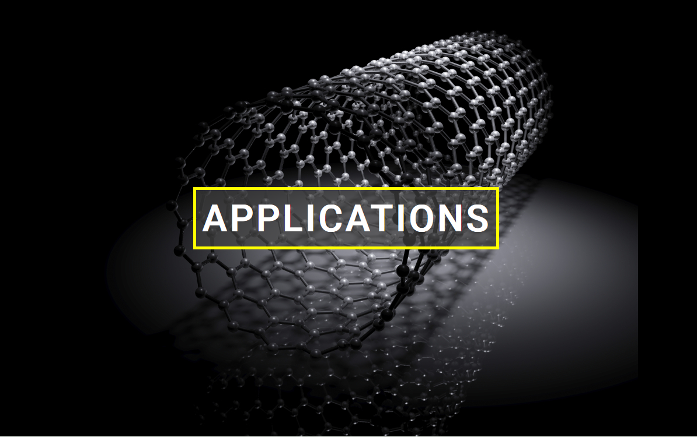

- __Applications Main Section__

  - This page gives an overview of some of the applications of 2-D materials to electronics.
  - It written in such a way as to be as self-contained in information from the other sections as, so an interested user may immediately jump straight to it.
  - Text is displayed in colored and stylistic text boxes.
  - Images of the different applications are displayed in figures beside their respective textboxes.
  - This will add value to the user as it will excite them about futuristic technology made possible by nanoscience.

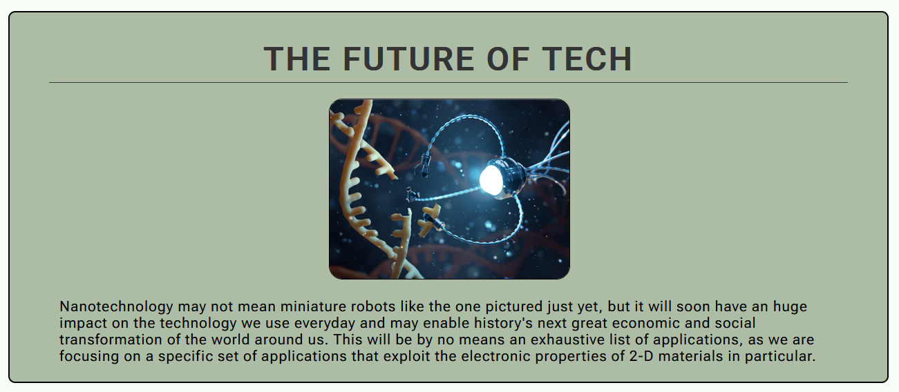
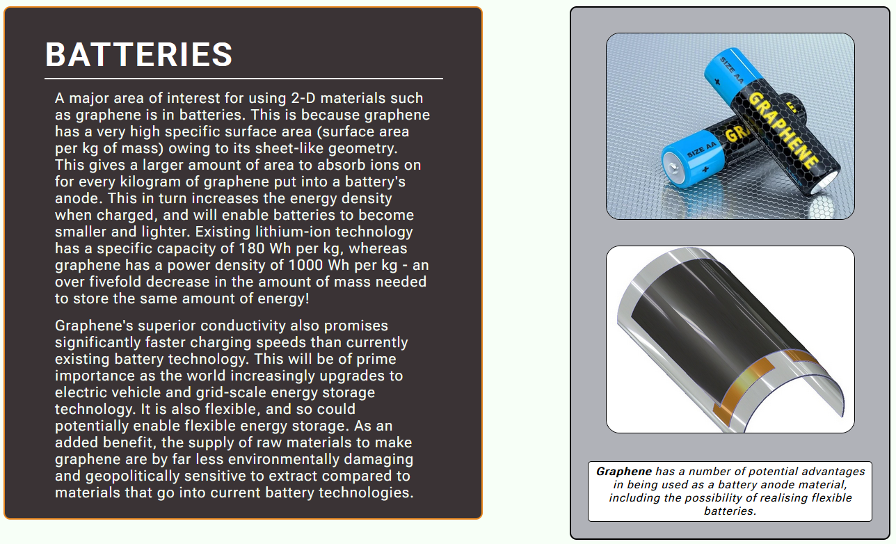
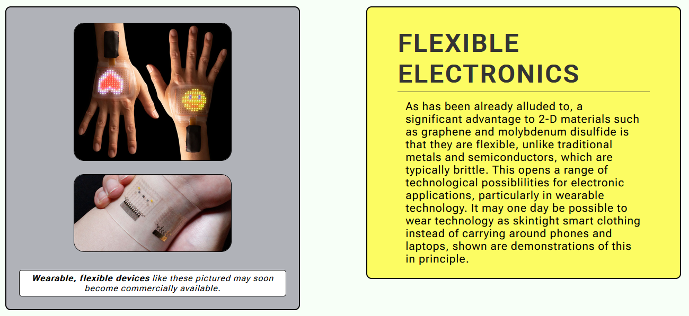
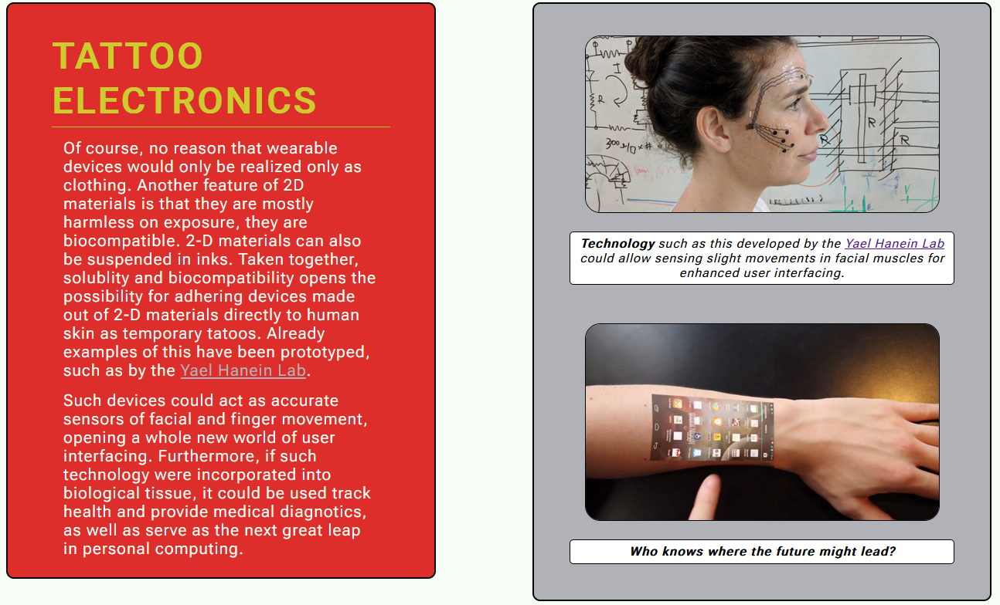

- __Contact Page__

- __Newsletter Signup Form__

- __Newsletter Submission Page__

### Features Left to Implement

***About in nav-bar appearance***

One feature that I wanted to implement was a means of the about button in the navigation bar to change to the active color when scrolling down past a certain point of the landing page, so it would look like this: 

![AboutNav]

However as far as I have checked querying how far the user is scrolled down the page is only possible to do with javascript, which is outside of the scope of the module.

***News Page***

I also wanted to add a page containing a widget that could scrub social media for mentions of nanotechnology using some kind of API, and then display them as a scrollable element. However this is much too complicated for the current point I am at in the course.

## Testing 

### Navigation Bars
**Navigation Bar**

- The following table goes through each button on the navigation bar, with columns detailing what the button should do when clicked, what it does when clicked, and a check to validate whether these buttons can be considered working or not. Each button was checked individually on each page.

|Button on bar      |Expected Behavior                      |What Occurs                            |Working as intended?   |
|:------------------|:--------------------------------------|:--------------------------------------|:---------------------:|
|Home               |Navigates to index.html                |Navigates to index.html                |✔                     |
|Materials          |Navigates to materials.html            |Navigates to materials.html            |✔                     |
|Applications       |Navigates to applications.html         |Navigates to applications.html         |✔                     |
|About              |Navigates to about anchor in index.html|Navigates to about anchor in index.html|✔                     |
|Contact            |Navigates to contact.html              |Navigates to contact.html              |✔                     |

**Hamburger Navigation Bar**

- Similar to the previous section, the below table how each button in the hamburger menu is expected to and actually functions. Each button was validated across each page of the website.

|Button on bar      |Expected Behavior                      |What Occurs                            |Working as intended?   |
|:------------------|:--------------------------------------|:--------------------------------------|:---------------------:|
|Hamburger          |Drops down vertical navigation bar     |Drops down vertical navigation bar     |✔                     |
|Home               |Navigates to index.html                |Navigates to index.html                |✔                     |
|Materials          |Navigates to materials.html            |Navigates to materials.html            |✔                     |
|Applications       |Navigates to applications.html         |Navigates to applications.html         |✔                     |
|About              |Navigates to about anchor in index.html|Navigates to about anchor in index.html|✔                     |
|Contact            |Navigates to contact.html              |Navigates to contact.html              |✔                     |

### Links

**Links in Footer page**

These were checked across each page of the website.

|Link                                   |Expected Behavior                                      |What Occurs                                        |Working as intended?   |
|:--------------------------------------|:------------------------------------------------------|:--------------------------------------------------|:---------------------:|
|Facebook                               |Opens [Facebook](https://www.facebook.com/) in new tab |Opens [Facebook](https://www.facebook.com/) in new tab |✔                     |
|Instagram                              |Opens [Instagram](https://www.instagram.com/) in new tab|Opens [Instagram](https://www.instagram.com/) in new tab|✔                     |
|Twitter                                |Opens [Twitter](https://www.twitter.com/) in new tab   |Opens [Twitter](https://www.twitter.com/) in new tab   |✔                     |
|LinkedIn                               |Opens [LinkedIn](https://www.linkedin.com/) in new tab |Opens [LinkedIn](https://www.linkedin.com/) in new tab |✔                     |

**Links in Materials page**

|Link                                   |Expected Behavior                      |What Occurs                            |Working as intended?   |
|:--------------------------------------|:--------------------------------------|:--------------------------------------|:---------------------:|
|NANONOW (page logo)                    |Navigates to index.html in same tab    |Navigates to index.html in same tab    |✔                     |
|"There's plenty of room at the bottom" |Opens [wikipedia page](https://en.wikipedia.org/wiki/There%27s_Plenty_of_Room_at_the_Bottom) in new tab|Opens [wikipedia page](https://en.wikipedia.org/wiki/There%27s_Plenty_of_Room_at_the_Bottom) in new tab|✔                     |
|materials                              |Navigates to materials.html in same tab|Navigates to materials.html in same tab|✔                     |

**Links in Applications page**

|Link                                   |Expected Behavior                      |What Occurs                            |Working as intended?   |
|:--------------------------------------|:--------------------------------------|:--------------------------------------|:---------------------:|
|NANONOW (page logo)                    |Navigates to index.html in same tab    |Navigates to index.html in same tab    |✔                     |
|Yael Hanein Lab (in Tatoo Electronics) |Opens [Yael Hanein's](https://nano.tau.ac.il/hanein/index.php/projects/tattoo-semg) webpage in new tab|Opens [Yael Hanein's](https://nano.tau.ac.il/hanein/index.php/projects/tattoo-semg) webpage in new tab|✔                     |
|Yael Hanein Lab (in figure caption)    |Opens [Yael Hanein's](https://nano.tau.ac.il/hanein/index.php/projects/tattoo-semg) webpage in new tab|Opens [Yael Hanein's](https://nano.tau.ac.il/hanein/index.php/projects/tattoo-semg) webpage in new tab|✔                     |

**Links in Contact page**

|Link                                   |Expected Behavior                      |What Occurs                            |Working as intended?   |
|:--------------------------------------|:--------------------------------------|:--------------------------------------|:---------------------:|
|NANONOW (page logo)                    |Navigates to index.html in same tab    |Navigates to index.html in same tab    |✔                     |
|info@nanonow.com                       |Opens email prompt in browser          |Opens email prompt in browser          |✔                     |

### Newsletter signup form 

### Different viewports

### Bugs 

  - When the hamburger menu is active for small viewports and the page is loaded, the hamburger icon can take a moment to load in and the button is momentarily thinner that it should be. This is likely because the icon is accessed from font-awesome. A solution to avoid this could be to render the hamburger icon with 3 grey spans instead.  

### Validator Testing 

- HTML
  - No errors were returned when passing through the official [W3C validator](https://validator.w3.org/nu/?doc=https%3A%2F%2Fcode-institute-org.github.io%2Flove-running-2.0%2Findex.html)
- CSS
  - No errors were found when passing through the official [(Jigsaw) validator](https://jigsaw.w3.org/css-validator/validator?uri=https%3A%2F%2Fvalidator.w3.org%2Fnu%2F%3Fdoc%3Dhttps%253A%252F%252Fcode-institute-org.github.io%252Flove-running-2.0%252Findex.html&profile=css3svg&usermedium=all&warning=1&vextwarning=&lang=en#css)

### Unfixed Bugs

## Deployment

- This project was deployed through github pages. The link: 

## Credits 

### Code

- The hamburger menu was created with code from a page on [Code-Boxx](https://code-boxx.com/simple-responsive-pure-css-hamburger-menu/).
- A number of individual queries and fixes were sought on [Stack Overflow](https://stackoverflow.com/).
- For refreshing certain concepts and documentations, I used [W3S Schools](https://www.w3schools.com/).

### Content 

- Inspiration was taken from [nano.gov](https://www.nano.gov/about-nanotechnology/applications-nanotechnology) and [Wikipedia's Applications of Nanotechnology page](https://en.wikipedia.org/wiki/Applications_of_nanotechnology) to populate the site content.
- I used various wikipedia pages on the topic to check my knowledge as I was entering content.
- The icons in the footer were taken from [Font Awesome](https://fontawesome.com/).

### Media

The following lists each image by their name in the /assets/images folder, with a link to the site they were taken from. Where possible, they are listed in order of appearance.

- __Homepage__
  - graphene - [SingularityHub](https://singularityhub.com/2018/08/05/beyond-graphene-the-promise-of-2d-materials/)
  - bodyarmor - [Pinterest](https://www.pinterest.ie/pin/warriors-of-honor--534661786985745203/)
  - solarpanels - [Wiley Online Library](https://onlinelibrary.wiley.com/doi/toc/10.1002/(ISSN)2567-3165.perovskite-materials)
  - nostain - [LinkedIn](https://www.linkedin.com/pulse/our-fluid-repellent-stain-resistant-clothing-uniforms-manavalan/?trk=portfolio_article-card_title)
  - hydrogen - [Fine Art America](https://fineartamerica.com/featured/hydrogen-fuel-cell-concept-car-jim-west.html?product=art-print)
  
  - humanheight - [Engineering Stack Exchange](https://engineering.stackexchange.com/questions/21200/what-is-best-sensor-method-to-measure-human-height)
  - coin - [Etsy](https://www.etsy.com/ie/listing/783952494/coin-1-euro-latvia-2014-latvijas)
  - pinhead - [Fine Art America](https://fineartamerica.com/featured/pin-head-and-point-dennis-kunkel-microscopyscience-photo-library.html)
  - hair - [Micropedia](https://microspedia.blogspot.com/2017/09/microscope-view-of-hair.html)
  - nanoscale - [Dartmouth Undergraduate Journal of Science](https://sites.dartmouth.edu/dujs/2009/02/22/turning-to-nanotechnology-for-pollution-control-applications-of-nanoparticles/)

- __Materials page__
  - buckies - https://www.chemistryworld.com/news/buckyballs-prove-to-be-a-magnetic-proposition-for-copper/8833.article

  - metalnp - [Anton Paar](https://www.anton-paar.com/se-en/products/applications/size-and-shape-of-gold-nanoparticles-in-toluene-via-saxs/)
  - buckyball - [Buckminister Fuller Institute](https://www.bfi.org/about-fuller/big-ideas/buckminsterfullerene/)
  - liposome - [Skeptical Raptor](https://www.skepticalraptor.com/skepticalraptorblog.php/lipid-nanoparticles-in-covid-19-mrna-vaccines-ican-fails-science/)

  - cntsingle - [The World of Nanoscience](https://worldofnanoscience.weebly.com/nanotube--carbon-fiber-overview.html)
  - nanowire - [Physics World](https://physicsworld.com/a/nanowire-thickness-alters-gaas-band-structure/)
  - dna - [The Healthcare Technology Report](https://thehealthcaretechnologyreport.com/environmental-dna-may-have-applications-for-disease-transmission-among-other-uses/)

  - graphenesheet - [AZO Materials](https://www.azom.com/article.aspx?ArticleID=21100)
  - graphenefootball - [Ossilia](https://www.ossila.com/pages/introduction-2d-materials)
  - bn - [Ossilia](https://www.ossila.com/products/hexagonal-boron-nitride)
  - mos2 - [Ossilia](https://www.ossila.com/en-eu/pages/molybdenum-disulfide-mos2)

- __Applications page__
  - cnt - [Investment Castings](https://www.investment-castings.net/what-are-carbon-nanotubes-and-why-should-you-care/)

  - robot - [Medical Device Network](https://www.medicaldevice-network.com/comment/nanotechnology-medicine-technology/)

  - graphenebattery - [AZO Materials](https://www.azom.com/article.aspx?ArticleID=21103) 
  - flexbattery - 

  - skindisplay - https://spectrum.ieee.org/skin-displays-will-give-wearables-their-independence
  - wearable - https://spie.org/news/wearable-photonics?SSO=1
  
  - nanotattoo - https://nano.tau.ac.il/hanein/index.php/projects/tattoo-semg
  - armphone - https://blog.teamtrade.cz/crumpled-carbon-nanotube-forests-lead-to-wearable-tech/

- __Contact page__
  - 

